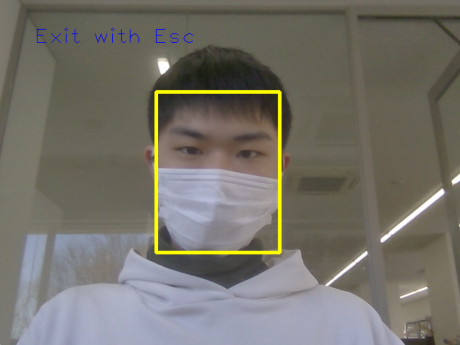

# face_detection
 Face Detection with OpenVINO

# DEMO


# Feature
 Detects a specified number of faces, starting from the nearest one.
 
# Requirements
* Python 3.8.10
* openvino 2021.4.2
* openvino-dev[pytorch] 2021.4.2

# Usage
```bash
git clone https://github.com/yukiharada1228/face_detection.git
cd face_detection
pip install -r requirements.txt
python face_detect.py [Number of detections] [threshold]
(example)
python face_detect.py
python face_detect.py 1
python face_detect.py 1 0.8
```

# Author 
* Yuki Harada
* yukiharada1228@gmail.com
